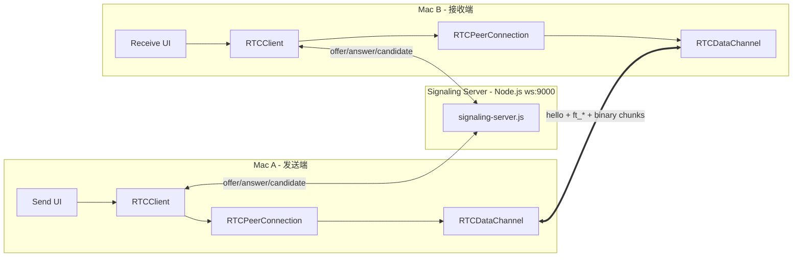
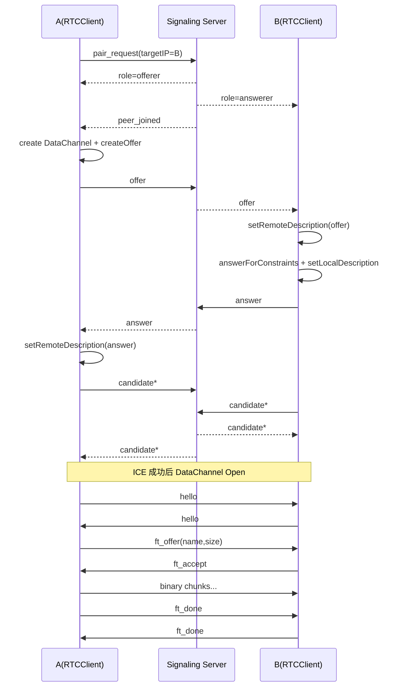

# WebRTC 文件传输 实现（前后端 + 通信流程 + 架构图）

## 1. 介绍

 **macOS 端到端文件传输 Demo**：  
通过一个轻量的 `WebSocket` 信令服务器完成配对和 SDP/ICE 交换，随后双方通过 `WebRTC DataChannel` 直接传文件（点对点）。

---

## 2. 前后端职责划分

## 2.1 后端（`signaling-server.js`）做什么

后端只做“信令中转”和“设备配对”，**不传文件数据本体**。

- 维护在线客户端：`clientsByIP`（实际是 `remoteAddress:remotePort`）
- 广播在线设备列表：`peers`
- 处理 A 发起的配对请求：`pair_request`
- 分配角色：
  - 发起方 -> `offerer`
  - 被邀请方 -> `answerer`
- 在已配对的两端之间中转：
  - `offer`
  - `answer`
  - `candidate`
- 连接断开时通知对端：`peer_left`

> 重点：服务端是“撮合 + 转发信令”，不是媒体/文件中继服务器。

关键代码对照：

```js
// 在线设备列表广播
function sendPeerList(ws) {
  if (!ws || ws.readyState !== 1) return;
  ws.send(JSON.stringify({ type: 'peers', peers: buildPeerListFor(ws) }));
}
```

```js
// 配对 + 角色分配
if (p.type === 'pair_request') {
  ws._pairPartner = targetWs;
  targetWs._pairPartner = ws;

  ws.send(JSON.stringify({ type: 'role', role: 'offerer', selfIP: ws._clientIP }));
  targetWs.send(JSON.stringify({
    type: 'role',
    role: 'answerer',
    selfIP: targetWs._clientIP,
    peerIP: ws._clientIP
  }));
}
```

```js
// 已配对后，除 peer_left 外全部透明转发给对端
const partner = ws._pairPartner;
if (!partner || partner.readyState !== 1) return;
if (p.type === 'peer_left') return;
partner.send(JSON.stringify(p));
```

## 2.2 前端/客户端（macOS）做什么

核心在 `RTCClient.m` + 容器控制器 `HXAirDropStyleTransferViewController.m`。

- 建立 WebSocket 信令连接
- 创建 `RTCPeerConnection`（显式 STUN 配置）
- 按角色完成 `offer/answer` 协商
- 交换并添加 `ICE candidate`
- 建立/接收 `DataChannel`
- DataChannel open 后交换 `hello`（设备名、IP、角色）
- 文件协议（控制消息 + 二进制 chunk）：
  - `ft_offer` / `ft_accept` / `ft_reject` / `ft_cancel` / `ft_done`
  - 文件二进制按 chunk 发送，带背压控制

关键代码对照：

```objc
// 显式创建 PeerConnection + STUN
RTCConfiguration *config = [[RTCConfiguration alloc] init];
RTCIceServer *stun = [[RTCIceServer alloc] initWithURLStrings:@[@"stun:stun.l.google.com:19302"]];
config.iceServers = @[stun];
self.peerConnection = [self.factory peerConnectionWithConfiguration:config constraints:nil delegate:self];
```

```objc
// 收到 role / peer_joined 后由 offerer 发起 createOffer
if ([type isEqual:@"role"]) {
    weakSelf.isOfferer = [role isEqual:@"offerer"];
}
if ([type isEqual:@"peer_joined"]) {
    if (weakSelf.isOfferer) { [weakSelf createOffer]; }
}
```

```objc
// DataChannel 打开后发送 hello（业务层消息）
- (void)dataChannelDidChangeState:(RTCDataChannel *)dataChannel {
    if (dataChannel.readyState == RTCDataChannelStateOpen) {
        [self sendHello];
    }
}
```

---

## 3. 从“用户点击发送”到“文件传完”的全过程

下面以 A（发送端）点击 B（目标设备）为例。

1. A 在在线设备列表里选择 B  
2. A 发信令：`pair_request(targetIP=B)` 给服务器  
3. 服务器验证双方空闲后配对成功，分别发：
   - 给 A：`role=offerer`
   - 给 B：`role=answerer`
4. 服务器再通知 A：`peer_joined`
5. A（offerer）收到后：
   - 创建 DataChannel（`chat`）
   - `createOffer` -> `setLocalDescription`
   - 通过信令发 `offer`
6. B（answerer）收到 `offer` 后：
   - `setRemoteDescription(offer)`
   - `answerForConstraints` 生成 answer SDP
   - `setLocalDescription(answer)`
   - 通过信令发 `answer`
7. A 收到 `answer`：
   - `setRemoteDescription(answer)`
8. 双方持续交换 `candidate`（可能先到，先缓存，等 remoteDescription 后 flush）
9. P2P 通道就绪后，DataChannel 进入 `open`
10. 双方各自发送 `hello`（这一步走 DataChannel）
11. A 发 `ft_offer(name,size,chunk)` 给 B
12. B 点接收后回 `ft_accept`
13. A 开始按 chunk 发二进制数据，B 写文件并回调进度
14. 发送完成后双方用 `ft_done` 收尾，清理状态

### 3.1 流程与关键代码一一对应（建议演讲时按这个顺序讲）

1) A 选择 B 后发起配对

```objc
// HXAirDropStyleTransferViewController.m
self.pendingPeerIP = ip;
self.pendingAutoSend = YES;
[self.rtcClient connectToPeerIP:ip];
```

```objc
// RTCClient.m
- (void)connectToPeerIP:(NSString *)peerIP {
    NSDictionary *msg = @{ @"type": @"pair_request", @"targetIP": peerIP };
    [self sendSignalingJSONObject:msg];
}
```

2) 服务器给 A/B 分配角色，并通知 A `peer_joined`

```js
ws.send(JSON.stringify({ type: 'role', role: 'offerer', selfIP: ws._clientIP }));
targetWs.send(JSON.stringify({ type: 'role', role: 'answerer', selfIP: targetWs._clientIP, peerIP: ws._clientIP }));
ws.send(JSON.stringify({ type: 'peer_joined', peerIP: targetWs._clientIP }));
```

3) A 创建 DataChannel + Offer，并发给 B

```objc
RTCDataChannelConfiguration *dcConfig = [[RTCDataChannelConfiguration alloc] init];
dcConfig.isOrdered = YES;
self.dataChannel = [self.peerConnection dataChannelForLabel:@"chat" configuration:dcConfig];
[self.peerConnection offerForConstraints:constraints completionHandler:^(RTCSessionDescription *sdp, NSError *error) {
    [weakSelf.peerConnection setLocalDescription:sdp completionHandler:^(NSError *error) {
        [weakSelf sendSignalingJSONObject:@{ @"type": @"offer", @"sdp": sdp.sdp }];
    }];
}];
```

4) B 收到 Offer，生成 Answer 回给 A

```objc
[weakSelf.peerConnection setRemoteDescription:offer completionHandler:^(NSError *error) {
    RTCMediaConstraints *constraints = [[RTCMediaConstraints alloc] initWithMandatoryConstraints:nil optionalConstraints:nil];
    [weakSelf.peerConnection answerForConstraints:constraints completionHandler:^(RTCSessionDescription *sdp, NSError *error) {
        [weakSelf.peerConnection setLocalDescription:sdp completionHandler:^(NSError *error) {
            [weakSelf sendSignalingJSONObject:@{ @"type": @"answer", @"sdp": sdp.sdp }];
        }];
    }];
}];
```

5) 双方交换 ICE candidate（未 ready 时先缓存）

```objc
if ([type isEqual:@"candidate"]){
    RTCIceCandidate *candidate = ...;
    if (weakSelf.hasRemoteDescription) {
        [weakSelf.peerConnection addIceCandidate:candidate];
    } else {
        [weakSelf.pendingCandidates addObject:candidate];
    }
}
```

6) DataChannel open 后交换 hello，再进入文件传输

```objc
- (void)dataChannelDidChangeState:(RTCDataChannel *)dataChannel {
    if (dataChannel.readyState == RTCDataChannelStateOpen) {
        [self sendHello];
    }
}
```

```objc
// A 发发送请求
NSDictionary *offer = @{@"t": @"ft_offer", @"name": name, @"size": @(total), @"chunk": @(self.chunkSize)};
[self sendControlJSON:offer];
```

```objc
// B 同意后 A 开始发送循环
if ([t isEqual:@"ft_accept"]) {
    [self startSendingLoop];
}
```

```objc
// 发送完成
[self sendControlJSON:@{@"t": @"ft_done"}];
[self cleanupTransferWithError:nil];
```

---

## 4. 关键问题

## 4.1 `candidates` 是干嘛的（以 B 视角）

`candidate` 是 ICE 候选地址，用来告诉对端“你可以通过哪些网络路径连到我”。  

以 B 为视角：

- B 本地网络探测会不断产出 candidate（host/srflx/relay）
- B 通过信令把 candidate 发给 A
- B 也接收 A 的 candidate，并 `addIceCandidate`
- 当 remoteDescription 还没设好时，B 会先放进 `pendingCandidates`
- 等 `setRemoteDescription` 完成后再统一 flush

`pendingCandidates` 的设计意义：

- WebRTC 里 SDP（`offer/answer`）和 ICE candidate 是并行异步到达的，顺序不保证。
- `addIceCandidate` 的前提是本端已经有对应的 `RemoteDescription`。
- 如果 candidate 比 SDP 先到，直接 `addIceCandidate` 可能失败或被忽略。
- 所以代码里先把“早到的 candidate”缓存到 `pendingCandidates`，等 `setRemoteDescription` 成功后再统一 add。
- 这能保证网络时序乱序时也不丢候选路径，提升连接成功率。

一句话总结：`pendingCandidates` 是一个“候选暂存池”，专门解决 “candidate 先到、SDP 后到” 的时序问题。

作用本质：帮助 A/B 在复杂网络环境里找到可达路径，最终让 DataChannel 连通。

## 4.2 B 执行 `answerForConstraints` 后，A 会发生什么

`answerForConstraints` 本身只在 B 本地生成 SDP answer。  
真正影响 A 的是后续两步：

1. B `setLocalDescription(answer)`  
2. B 把 `answer` 通过信令发给 A  

A 收到 `answer` 后会：

- `setRemoteDescription(answer)`
- 标记 `hasRemoteDescription = YES`
- 把之前缓存的 candidates flush 到 PeerConnection
- 随着 ICE 检测推进，最终 DataChannel 进入 `open`

## 4.3 `answerForConstraints` 内部会不会发 DataChannel 消息？

不会。  

`answerForConstraints` 做的是 SDP 生成（协商层），不负责业务层 DataChannel 发消息。  
你这个项目里 DataChannel 文本消息（如 `hello`、`ft_offer`）是在 `dataChannelDidChangeState`/`sendControlJSON` 这套逻辑里发送的，和 `answerForConstraints` 是两个层次。

---

## 5. 架构图（总体）



---

## 6. 时序图（信令 + 传输）



---

